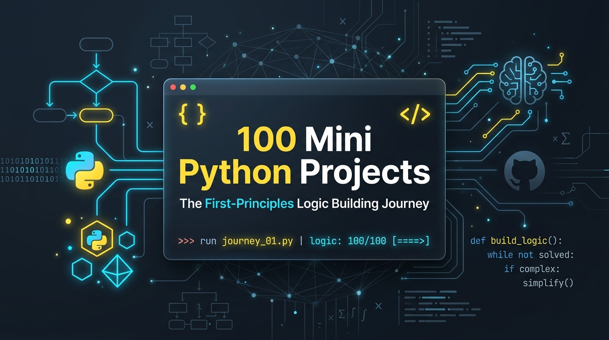

<div align="center">



# 🧠 100 Mini Python Projects: The First-Principles Logic Journey

**A deliberate 100-project masterclass in algorithmic thinking, mental modeling, and self-reliant software engineering.**

[](https://www.python.org/)
[-00C853?style=for-the-badge)](https://github.com/kumarnallana/100-Mini-Pytho-Projects)
[](https://github.com/kumarnallana/100-Mini-Pytho-Projects)
[](LICENSE)

<br />

*"True programming mastery is not measured by how fast you can prompt an AI or copy-paste code. It is forged by breaking a problem down to its core invariants, formulating the logic step-by-step in your own mind, and crafting the solution from first principles."*

</div>

---

## 📜 The Manifesto: Why This Journey?

In modern software development, it has become temptingly easy to ask AI assistants for pre-packaged code. While AI is a powerful accelerator, relying on it prematurely creates an illusion of competence—leaving developers with brittle problem-solving intuition, weak debugging skills, and an inability to reason through complex edge cases.

This repository marks a conscious decision to **start over from the ground up**:
- 🛑 **No Blind Copy-Pasting**: Every project is architected and solved independently.
- 🧩 **First-Principles Thinking**: Rely on core language constructs—loops, conditionals, pointers, state machines, and mathematical formulas—before reaching for high-level abstractions.
- 📐 **Visual Logic Before Syntax**: Write pseudocode and draw logic flow diagrams before writing a single line of Python.
- 🏗️ **Mental Muscle Memory**: Solve 100 distinct real-world and algorithmic problems across 10 progressive tiers to build unshakeable confidence as an engineer.

---

## 🔬 The 4-Step Engineering Protocol

Every single project in this repository adheres to a strict four-phase methodology:

```
┌─────────────────────────┐
│ 1. Deconstruct Problem  │ ──► Identify inputs, outputs, invariants & edge cases
└────────────┬────────────┘
             ▼
┌─────────────────────────┐
│ 2. Visual & Pseudocode  │ ──► Model the logic card & write language-agnostic pseudocode
└────────────┬────────────┘
             ▼
┌─────────────────────────┐
│ 3. Pure Implementation  │ ──► Implement cleanly in Python using first-principles logic
└────────────┬────────────┘
             ▼
┌─────────────────────────┐
│ 4. Analyze & Reflect    │ ──► Determine Time/Space complexity O(n) & capture lessons
└─────────────────────────┘
```

---

## 📊 Progress Dashboard

| Tier | Focus Area | Projects | Status | Progress |
| :---: | :--- | :---: | :---: | :---: |
| **01** | Foundations & Accumulator Logic | 01 – 10 | 🟡 In Progress | 1 / 10 |
| **02** | Control Flow, Collections & State | 11 – 20 | ⚪ Upcoming | 0 / 10 |
| **03** | Data Processing, Parsing & File I/O | 21 – 30 | ⚪ Upcoming | 0 / 10 |
| **04** | Object-Oriented Design & Simulators | 31 – 40 | ⚪ Upcoming | 0 / 10 |
| **05** | Core Data Structures from Scratch | 41 – 50 | ⚪ Upcoming | 0 / 10 |
| **06** | Classic Algorithms & Problem Solving | 51 – 60 | ⚪ Upcoming | 0 / 10 |
| **07** | CLI Power Tools & Workflow Utilities | 61 – 70 | ⚪ Upcoming | 0 / 10 |
| **08** | Interactive Games & Simulations | 71 – 80 | ⚪ Upcoming | 0 / 10 |
| **09** | Networking, Web & API Engineering | 81 – 90 | ⚪ Upcoming | 0 / 10 |
| **10** | Capstone Systems & Interpreters | 91 – 100 | ⚪ Upcoming | 0 / 10 |
| **TOTAL** | **The Complete Logic Challenge** | **100** | 🚀 **1% Complete** | **1 / 100** |

---

## 🗺️ The Complete 100-Project Curriculum

### Tier 1: Foundations & Accumulator Logic (Projects 01–10)
> *Focus: Raw iteration, state accumulation, conditional branching, and scalar math.*

- [x] **01. [Salary Expense Tracker](./Project-1~Salary_Expense_Tracker)** — Manual record counting, sum accumulation, threshold filtering, and OOP reporting.
- [ ] **02. Number Guessing Engine** — Binary search boundaries, attempt budgeting, and dynamic hint feedback loops.
- [ ] **03. Word & Character Frequency Counter** — Pure string traversal and hash counters without standard library shortcuts.
- [ ] **04. Rock-Paper-Scissors with Probability Tracker** — Player pattern detection and win-streak evaluation.
- [ ] **05. Palindrome & Anagram Verifier** — Two-pointer string scanning and frequency map comparison.
- [ ] **06. Prime Number Sieve & Factorization** — Sieve of Eratosthenes and prime factor tree generation.
- [ ] **07. Temperature & Unit Converter** — Multi-unit conversion matrix with clean state management.
- [ ] **08. Password Strength & Entropy Evaluator** — Shannon entropy estimation and character-class rule scoring.
- [ ] **09. Bill Splitter & Fair Tip Engine** — Exact change distribution and rounding residue resolution.
- [ ] **10. Roman Numeral Dual Converter** — Greedy subtractive pattern matching (Roman ↔ Decimal).

---

### Tier 2: Control Flow, Collections & State (Projects 11–20)
> *Focus: Dictionaries, nested structures, state machines, and string manipulation.*

- [ ] **11. Caesar & Vigenère Cipher Engine** — Modular arithmetic encoding and decoding.
- [ ] **12. Contact Book CLI** — In-memory dictionary CRUD with fuzzy substring search.
- [ ] **13. Flashcard Quiz Runner** — Card shuffling, scoring thresholds, and weak-card re-queueing.
- [ ] **14. Habit Streak & Consistency Tracker** — Date arithmetic and contiguous streak calculation.
- [ ] **15. E-Commerce Cart & Promo Rule Engine** — Conditional multi-tier discount evaluation.
- [ ] **16. Terminal To-Do Engine with Priorities** — Priority sorting and state transition tracking.
- [ ] **17. Text Obfuscator & Pig Latin Translator** — Word parsing, diphthong preservation, and custom phonetic rules.
- [ ] **18. Matrix Arithmetic Engine** — Nested list addition, transposition, and 2D dot product.
- [ ] **19. Tic-Tac-Toe Two-Player CLI** — 2D coordinate validation, win-state scanning, and draw detection.
- [ ] **20. Luhn Algorithm Credit Card Validator** — Checksum calculation and card issuer identification.

---

### Tier 3: Data Processing, Parsing & File I/O (Projects 21–30)
> *Focus: Raw byte/stream handling, custom text parsers, and persistent state storage.*

- [ ] **21. Custom CSV Parser & Serializer** — Handling delimiters, escaped quotes, and newlines from scratch.
- [ ] **22. Server Log Analyzer & Error Extractor** — Timestamp parsing, regex pattern extraction, and error rate metrics.
- [ ] **23. Markdown to HTML Mini-Compiler** — Line-by-line state machine for headers, lists, code blocks, and bold/italic.
- [ ] **24. JSON Formatter & Key-Value Flattener** — Recursive tree traversal of nested JSON structures.
- [ ] **25. Personal Budget & Expense Manager** — JSON persistence, categorizer, and monthly balance summaries.
- [ ] **26. Duplicate File Detector by Hash** — Chunked MD5/SHA-256 byte streaming and collision grouping.
- [ ] **27. Text Diff Checker** — Longest Common Subsequence (LCS) line diff with visual additions/deletions.
- [ ] **28. INI / Configuration File Parser** — Section parsing, typed value casting, and comment stripping.
- [ ] **29. Terminal Stopwatch & Lap Analyzer** — High-resolution time-delta calculations and formatted splits.
- [ ] **30. Morse Code Audio/Text Dual Translator** — Bidirectional lookup trees and rhythm timing representation.

---

### Tier 4: Object-Oriented Design & System Simulators (Projects 31–40)
> *Focus: Encapsulation, inheritance, polymorphism, design patterns, and domain modeling.*

- [ ] **31. ATM & Banking System** — Accounts, transaction ledger, PIN authentication, and overdraft limits.
- [ ] **32. Digital Library Management System** — Item catalog, patron lending rules, overdue fine calculators.
- [ ] **33. Multi-Level Parking Lot Simulator** — Vehicle dimensions, spot allocation, and hourly ticket pricing.
- [ ] **34. Vending Machine State Pattern** — Coin acceptance, change inventory, and inventory stock state.
- [ ] **35. Turn-Based RPG Battle Engine** — Hero/Monster classes, turn queues, RNG damage formulas, and status effects.
- [ ] **36. Smart Elevator Dispatcher** — Multiple elevator scheduling, floor request queues, and idle positioning.
- [ ] **37. Student Gradebook & Weighted GPA Engine** — Subject credits, grading curves, and percentile rank calculations.
- [ ] **38. Coffee Machine Maker Simulator** — Ingredient tank depletion, custom recipe validation, and maintenance triggers.
- [ ] **39. Alarm Clock & Event Dispatcher** — Background worker loop, recurring schedules, and trigger queues.
- [ ] **40. Warehouse Inventory Stock Engine** — SKU generation, reorder thresholds, and FIFO/LIFO batch tracking.

---

### Tier 5: Core Data Structures from Scratch (Projects 41–50)
> *Focus: Memory layout, pointers, dynamic arrays, and custom data container architectures.*

- [ ] **41. Singly & Doubly Linked Lists** — Insertion, deletion, cycle detection (Floyd's algorithm), and in-place reversal.
- [ ] **42. Custom Stack & Syntax Validator** — Bracket matching, HTML tag balancer, and call-stack simulation.
- [ ] **43. Queue & Circular Ring Buffer** — Fixed-size circular array with overwrite and boundary management.
- [ ] **44. Binary Search Tree (BST)** — Recursive insert, search, delete (3 cases), and in-order/pre-order traversal.
- [ ] **45. Hash Map with Chaining** — Custom hash function, bucket array, load factor resizing, and collision chaining.
- [ ] **46. Min/Max Binary Heap & Priority Queue** — Array-based heapify, sift-up, and sift-down operations.
- [ ] **47. Trie (Prefix Tree)** — Word insertion, prefix matching, and predictive autocomplete engine.
- [ ] **48. Disjoint Set Union (Union-Find)** — Connected components with union-by-rank and path compression.
- [ ] **49. Graph Engine (Adjacency List & Matrix)** — Directed/undirected graphs with BFS and DFS traversals.
- [ ] **50. LRU (Least Recently Used) Cache** — Constant time $O(1)$ get and put using Hash Map + Doubly Linked List.

---

### Tier 6: Classic Algorithms & Problem Solving (Projects 51–60)
> *Focus: Divide & conquer, recursion, backtracking, dynamic programming, and greedy methods.*

- [ ] **51. Sorting Algorithm Visualizer (CLI)** — Step-by-step Bubble, Selection, Insertion, Merge, and Quick Sort.
- [ ] **52. Dijkstra’s Shunting-Yard Expression Evaluator** — Converting infix math expressions to postfix (RPN) and computing.
- [ ] **53. Sudoku Solver** — Recursive backtracking with constraint propagation (row, column, 3x3 box).
- [ ] **54. N-Queens Solver & Board Visualizer** — Backtracking safe placement algorithm for an $N \times N$ chessboard.
- [ ] **55. Maze Generator & Shortest Path Finder** — Randomized DFS maze creation and BFS shortest-path solver.
- [ ] **56. Huffman Coding Compression Engine** — Frequency tree generation, variable-length bit prefixing, and decoding.
- [ ] **57. 0/1 Knapsack Problem Solver** — Dynamic Programming 2D memoization table vs. Greedy comparison.
- [ ] **58. Levenshtein String Distance** — Edit distance calculation for spell check and typo suggestion.
- [ ] **59. Tower of Hanoi Visual Simulator** — Recursive disc movements with visual terminal pegs.
- [ ] **60. Collatz Conjecture & Number Theory Explorer** — Sequence generation, maximum trajectory peaks, and stopping times.

---

### Tier 7: CLI Power Tools & Practical Utilities (Projects 61–70)
> *Focus: Command-line ergonomics, argument parsing, OS interaction, and developer tooling.*

- [ ] **61. Recursive Directory Tree Generator** — Terminal visual directory hierarchy with file sizes and depth limits.
- [ ] **62. Batch File Renamer & Pattern Replacer** — Regex file renaming with dry-run verification mode.
- [ ] **63. Markdown Note-Taking & Tagging CLI** — Local note indexer, search by tag, and full-text keyword scanner.
- [ ] **64. TCP Port Scanner & Service Pinger** — Raw socket network connections, timeouts, and open-port reporting.
- [ ] **65. Pomodoro Productivity Timer** — Interval work/break cycles with ASCII progress bars and terminal rings.
- [ ] **66. System Resource Monitor** — Polling CPU, Memory, and Disk stats with dynamic ASCII mini-graphs.
- [ ] **67. Markdown Table Generator from Raw Text/CSV** — Column auto-padding, alignment markers, and table linting.
- [ ] **68. Spaced Repetition Flashcards (SuperMemo SM-2)** — Interval calculation based on ease factor and recall quality.
- [ ] **69. Currency Converter with Local Cache** — Exchange rate storage, cache expiration policies, and currency conversions.
- [ ] **70. CLI Calendar & Event Notification Engine** — Gregorian date math, month rendering, and reminder notifications.

---

### Tier 8: Interactive Terminal Games & Simulations (Projects 71–80)
> *Focus: Game loops, heuristic search, grid mechanics, physics modeling, and collision detection.*

- [ ] **71. Unbeatable Tic-Tac-Toe AI** — Minimax decision tree evaluation with recursion.
- [ ] **72. Connect Four with Alpha-Beta Pruning** — Heuristic evaluation function and depth-limited minimax.
- [ ] **73. Conway’s Game of Life** — Cellular automata grid simulation with toroid/bounded borders.
- [ ] **74. Terminal Snake Game** — Keyboard input buffer, snake body segments, food spawning, and self-collision.
- [ ] **75. Minesweeper CLI** — Mine distribution, recursive flood-fill for empty tile clearing, and flag tracking.
- [ ] **76. Blackjack Card Game** — Deck shuffling, dealer rules (stand on soft 17), split, and payout logic.
- [ ] **77. Mastermind Codebreaker** — Secret color pattern generator, feedback peg calculation, and Knuth solver.
- [ ] **78. 2048 Terminal Puzzle** — Grid shifting, tile merging arithmetic, empty cell spawning, and game-over detection.
- [ ] **79. Text-Based Dungeon Crawler RPG** — Procedural room generation, inventory, equipment, and combat encounters.
- [ ] **80. Terminal Flappy Bird (ASCII)** — Gravity physics, jump velocity, pipe generation, and hitbox collision.

---

### Tier 9: Networking, Web & API Engineering (Projects 81–90)
> *Focus: Socket programming, HTTP protocol specifications, serialization, and distributed concepts.*

- [ ] **81. HTTP 1.1 Server from Raw Sockets** — Socket listening, HTTP request line parsing, headers, MIME types, and status codes.
- [ ] **82. Multi-Client Chat Room Server & Client** — Multi-threaded socket server with broadcast message dispatching.
- [ ] **83. Web Scraper & HTML Tokenizer** — Stream parser extracting tags, attributes, and text nodes without external libraries.
- [ ] **84. REST API Client CLI** — Constructing HTTP requests, header injection, basic auth, and JSON output formatting.
- [ ] **85. Resumable File Downloader CLI** — Chunked byte streaming, HTTP Range headers, and visual progress metrics.
- [ ] **86. DNS Query Tool** — Constructing raw UDP DNS wire packets and parsing DNS answer records.
- [ ] **87. Base62 URL Shortener Engine** — Hashing, integer-to-base62 encoding, and collision-free redirection maps.
- [ ] **88. Static Site Generator (SSG)** — Reading Markdown frontmatter, rendering HTML templates, and compiling output sites.
- [ ] **89. Micro Web Framework** — Route registration (`@app.route`), query string parsing, and response pipelines.
- [ ] **90. Rate Limiter Engine** — Token Bucket and Leaky Bucket algorithms for throttling requests.

---

### Tier 10: Capstone Systems & Interpreters (Projects 91–100)
> *Focus: Compilers, database engines, distributed ledgers, and systems programming.*

- [ ] **91. Mini Git Version Control** — Recreating `.git`, `hash-object`, `cat-file`, `commit-tree`, and `log`.
- [ ] **92. Arithmetic Expression Lexer & AST Parser** — Tokenization, grammar definition, and recursive descent AST evaluation.
- [ ] **93. Lisp / Scheme Micro-Interpreter** — S-expression tokenizer, environment scope chains, and `eval`/`apply`.
- [ ] **94. In-Memory Key-Value Store (Mini Redis)** — TCP interface, commands (`SET`, `GET`, `DEL`, `EXPIRE`), and append-only log (AOF).
- [ ] **95. Mini Relational Database Engine** — Table storage, column schemas, and simple `SELECT ... WHERE ...` query parser.
- [ ] **96. Event-Driven Message Broker** — Publish/Subscribe topics, consumer subscriptions, and queue retention.
- [ ] **97. Bytecode Virtual Machine & Stack Runner** — Instruction set definition, opcodes (`PUSH`, `ADD`, `JUMP`), and execution stack.
- [ ] **98. Cron Job Scheduler & Background Worker** — 5-part cron syntax parsing and priority-based task dispatching.
- [ ] **99. Proof-of-Work Blockchain Simulator** — SHA-256 block hashing, proof-of-work mining difficulty, and ledger verification.
- [ ] **100. The Master Project — Portfolio CLI Dashboard** — Interactive terminal dashboard aggregating statistics, launch shortcuts, and summaries of all 100 projects.

---

## 📁 Repository Structure

```text
100-Mini-Pytho-Projects/
│
├── assets/
│   └── banner.png                     # Repository banner graphic
│
├── PROJECT_TEMPLATE.md                # Standard documentation template for new projects
├── README.md                          # Master directory, progress tracker & roadmap
│
├── Project-1~Salary_Expense_Tracker/  # Tier 1: Salary Expense Tracker (Completed)
│   ├── DAY-3_-SALARY-EXPENSE-TRACKER.png   # Visual logic card & pseudocode
│   ├── salaries.json                  # Sample dataset (5,000 records)
│   ├── salary_analyzer.py             # Pure Python implementation
│   └── README.md                      # Dedicated project documentation & complexity analysis
│
├── Project-2~Number_Guessing_Engine/  # Tier 1: Number Guessing Engine
│   ├── README.md                      # Dedicated project documentation (from template)
│   └── ...
│
└── Project-100~Portfolio_Dashboard/   # Tier 10: Portfolio CLI Dashboard
    └── ...
```

### 📖 Two-Tier Documentation Architecture

To maintain the highest engineering rigor, this repository operates on a strict **two-tier documentation standard**:

1. **Master Root Document ([`README.md`](./README.md))**:
   - Outlines the overarching philosophy and personal manifesto.
   - Tracks live progress across the 10 learning tiers.
   - Serves as the complete directory and roadmap of all 100 projects.

2. **Dedicated Project Documents ([`Project-1~Salary_Expense_Tracker/README.md`](./Project-1~Salary_Expense_Tracker/README.md))**:
   - **Every single project folder has its own isolated, dedicated `README.md`**.
   - Details the precise problem statement and input/output contracts.
   - Features the visual logic card / pseudocode diagram.
   - Documents the pseudocode step-by-step before implementation.
   - Details the pure Python solution, code structure, and execution instructions.
   - Provides time ($O$) and space ($O$) complexity benchmarks.
   - Captures personal lessons learned and mental models forged.
   
*(To start a new project, simply copy [`PROJECT_TEMPLATE.md`](./PROJECT_TEMPLATE.md) into your new project directory as `Project-X~Project_Name/README.md`).*

---

## 🛠️ How to Run Any Project

Each project is designed to be fully self-contained with zero external third-party dependencies required for foundational tiers.

1. Clone the repository:
   ```bash
   git clone https://github.com/kumarnallana/100-Mini-Pytho-Projects.git
   cd 100-Mini-Pytho-Projects
   ```
2. Navigate to the desired project folder:
   ```bash
   cd Project-1~Salary_Expense_Tracker
   ```
3. Run the project script:
   ```bash
   python salary_analyzer.py
   ```

---

## ✍️ Contribution & Personal Pledge

> **I pledge to:**
> 1. Solve each project with my own mental logic and deliberate practice.
> 2. Create a visual diagram or pseudocode card before writing code.
> 3. Embrace the struggle of debugging and reasoning through edge cases.
> 4. Keep this repository as living proof of steady, disciplined growth.

---

<div align="center">

Crafted with dedication by **[Kumar Nallana](https://github.com/kumarnallana)** • Keep Building, Keep Learning 🚀

</div>